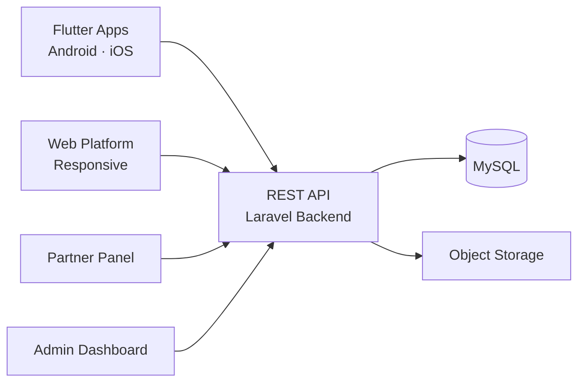

# Bscpad Clone — White-Label Solution by Miracuves

---

## Table of Contents

1. [Who Is This For?](#who-is-this-for)
2. [How It Works](#how-it-works)
3. [Core Features](#core-features)
4. [Architecture](#architecture)
5. [Revenue Streams](#revenue-streams)
6. [What's Included](#whats-included)
7. [Deployment Timeline](#deployment-timeline)
8. [Why Not Build From Scratch?](#why-not-build-from-scratch)
9. [Market Opportunity](#market-opportunity)
10. [Client Testimonials](#client-testimonials)
11. [FAQ](#faq)
12. [Resources](#resources)
13. [About Miracuves](#about-miracuves)

## Live Demos

| Environment | URL | What you can test |
|---|---|---|
| Web Platform | [mxico.mimeld.com](https://mxico.mimeld.com) | Full experience in the browser |
| Admin Dashboard | [Solution page → Demo](https://miracuves.com/bscpad-clone/#demo) | Users, content, plans, analytics |

Demo credentials: [miracuves.com/bscpad-clone -> Demo section](https://miracuves.com/bscpad-clone/#demo)

## What Makes This Bscpad Clone Different

<!-- TODO: fill 3-5 vertical-specific differentiators -->

## Who Is This For?

| Buyer Type | Use Case |
|---|---|
| Crypto Founders | Launch a token sale platform for new projects |
| Launchpad Operators | Build a multi-chain IDO platform with staking tiers |
| DeFi Investors | Create a curated launchpad for high-quality projects |

---

## How It Works

1. Projects apply for token sale with due diligence and KYC
2. Investors stake platform tokens to qualify for allocation tiers
3. Approved projects launch their token sale with set allocation rules
4. Investors participate in the sale based on their tier level
5. Tokens are distributed automatically after the sale ends
6. Secondary trading opens; platform collects fees on transactions

---

## Core Features

### User App
- Dashboard
- Wallet mgmt
- Trade/P2P transactions
- Order history
- KYC verification
- Notifications
- Support

### Admin Panel
- User management
- KYC/AML compliance
- Transaction monitoring
- Fee management
- Dispute resolution
- Security settings

---

## Advanced Features

The platform integrates AI-powered features that reduce manual overhead and capture revenue opportunities:

- **AI Fraud Detection** - Real-time monitoring of wash trading and suspicious wallet patterns
- **AI Project Scoring** - Automated due diligence scoring based on tokenomics and team data
- **AI Risk Scoring** - Assesses transaction & user risk
- **AI Market Analytics** - Trend predictions & insights

---

## Apps and Web Panels

| Module | Description |
|---|---|
| Investor App (iOS + Android) | Staking, IDO participation, portfolio, KYC |
| Web Dashboard | Project discovery, analytics, wallet connection |
| Admin Web Panel | Projects, staking, KYC, fees, analytics |

---

## Architecture

**Stack:**

| Layer | Technology |
|---|---|
| Mobile Apps | Flutter (iOS + Android, single codebase) |
| Web Platform | React.js with Web3 wallet integration |
| Backend API | Node.js + Express |
| Database | MongoDB |
| Blockchain | BSC, Ethereum, Polygon smart contracts |
| Wallet | MetaMask, WalletConnect, Trust Wallet integration |
| Cloud Hosting | AWS / DigitalOcean / Contabo VPS |

---

## Revenue Streams

The platform is engineered to generate revenue from day one through multiple complementary channels:

- **Project listing fees** - charged for each IDO listing
- **Success fees** - percentage of funds raised in each sale
- **Staking lock fees** - early unstaking penalty fees
- **Platform token appreciation** - value capture through token buyback
- **Cross-chain listing premiums** - additional fee for multi-chain launches
- Transaction fees
- Withdrawal fees
- Listing fees
- Premium memberships
- API access fees

---

## Security and Compliance

- OTP-based authentication
- SSL/TLS encrypted API communication
- GDPR-ready data handling

---

## What's Included

| Plan | Price | What You Get |
|---|---|---|
| Standard | **$3,099** | Complete source code, all apps, admin panel, rebranding, 1 year updates |
| Enterprise | Custom Quote | Everything in Standard + custom features, multi-region, priority support |

**What is included:**

- Investor App (iOS + Android)
- Web Dashboard
- Admin Web Panel
- Full Source Code
- Complete Rebranding (your logo, colors, app name)
- Server Deployment
- App Store and Google Play Submission Support
- 60 Days Free Bug Support
- Free 1-Year Updates

---
**Pricing:** from **$2,499** — transparent on the [solution page](https://miracuves.com/bscpad-clone/#pricing).

## Deployment Timeline

| Day | Milestone |
|---|---|
| Day 1 | Server setup, environment configuration, initial deployment |
| Day 2 | White-labeling - app name, logo, colors, splash screens |
| Day 3 | Payment gateway integration + third-party API configuration |
| Day 4 | Custom feature implementation (if applicable) |
| Day 5 | QA, testing, bug fixes across all panels |
| Day 6 | App Store + Google Play submission + Go-live |

> **Average go-live: 6 business days from payment confirmation.**

---

## Why Not Build From Scratch?

| Factor | Build from Scratch | Miracuves Solution |
|---|---|---|
| Time to Launch | 6-12 months | 6 days |
| Development Cost | $60,000-$150,000 | From $3,099 |
| Source Code Ownership | Yes | Yes |
| Customization | Full | Full |
| Post-Launch Support | Depends on team | 60 days included |
| Risk | High | Low |

---

## Market Opportunity

| Metric | Data |
|---|---|
| Total IDO Funds Raised (All Time) | $5 billion+ |
| Average IDO Raise (2024) | $500,000-$2 million |
| Active Launchpads | 300+ |
| Key Markets | BSC, Ethereum, Polygon, Solana |
| Average Participants per IDO | 5,000-50,000 |

> Source: Statista, Grand View Research, Allied Market Research

---

## Successful Verticals

- Multi-chain IDO launchpads
- Gaming token launch platforms
- DeFi project incubators and launchpads
- NFT collection launch platforms
- Cryptocurrency trading
- P2P exchange
- Token launchpad
- Digital banking
- Cross-border payments

---

## Client Testimonials

> *"The tiered staking system is exactly what investors want. We had 20,000 participants on our first IDO."*
> - Founder, Crypto Launchpad

> *"Exceptional results from day one."*
> - Verified Client

> *"Scaled 3x faster than expected."*
> - Startup Founder

---

## FAQ

**How much does a BSCPad clone cost?**
A white-label BSCPad clone from Miracuves starts at $3,099 with complete source code ownership.

**What blockchains are supported?**
BSC, Ethereum, and Polygon are supported out of the box with more chains available.

**Does it include smart contracts?**
Yes. Staking, sale, and token distribution smart contracts are included.

**Is KYC/AML included?**
Yes. Full investor verification with document upload, liveness check, and approval workflow.

**Do I get the source code?**
Yes. Complete source code ownership is included.

**How long does it take to launch?**
6 business days from payment confirmation.

---

## Related Solutions

Explore our other white-label clone solutions:

- [Binance Clone - Crypto Exchange](https://github.com/Miracuves-Solutions/Binance-Clone)
- [PancakeSwap Clone - DEX](https://github.com/Miracuves-Solutions/PancakeSwap-Clone)
- [Coinbase Clone - Crypto Exchange](https://github.com/Miracuves-Solutions/Coinbase-Clone)

---

## Resources

- [Full Solution Page](https://miracuves.com/bscpad-clone/) — features, pricing, demos, FAQ

## Get Started

**Ready to launch your crypto IDO launchpad?**

| Channel | Link |
|---|---|
| Full Solution Page | [miracuves.com/bscpad-clone](https://miracuves.com/bscpad-clone/) |
| Email | info@miracuves.com |
| WhatsApp | [+91 98300 09649](https://wa.me/919830009649) |
| Book a Call | [Free Consultation](https://miracuves.com/contact/) |

---

## About Miracuves

**Miracuves Solutions Pvt. Ltd.** is a Mumbai-based software company specializing in white-label clone app solutions across 12+ industries.

- 90+ ready-to-deploy solutions
- 6-day delivery guarantee
- 60+ engineers on staff
- 3,900+ apps delivered
- Full source code ownership
- Clients across 40+ countries including India and USA

[Explore all 90+ solutions at miracuves.com](https://miracuves.com)

---

## Disclaimer

This product is independently developed by Miracuves. All product names, logos, and brands are property of their respective owners. Use of these names does not imply endorsement.

---

*(c) 2026 Miracuves Solutions Pvt. Ltd. | Mumbai, India*
*This repository contains product documentation only - no proprietary source code is published here.*

*Keywords: bscpad clone, bscpad script, white label solution, laravel flutter app, clone script*

---

### Note on This Repository

This repository is a product overview. The full source code is delivered to clients on purchase. For a hands-on evaluation, use the live demos above; credentials are public on the solution page.

<!--
=========================================================
GENERATED FROM MIRACUVES NETFLIX-CLONE README TEMPLATE
Canon: 6 working days, from $2,799 floor, 60 days support + 12 months updates.
Never use 3 days. See https://miracuves.com/facts/ for audited claims.
=========================================================
-->
